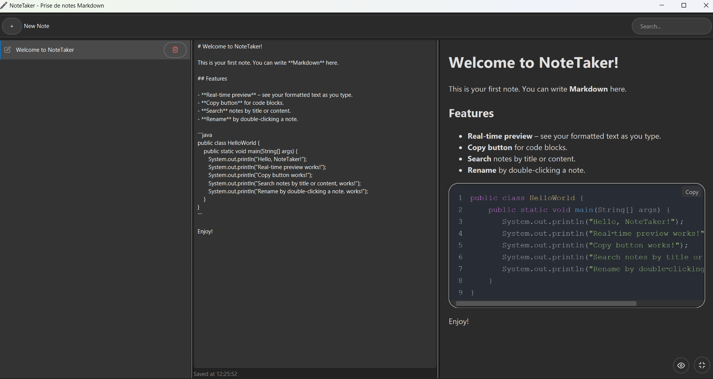

# NoteTaker – Markdown Note‑Taking App



**NoteTaker** is a cross‑platform desktop application for writing and previewing Markdown notes. It features a clean dark interface, live HTML preview, search, auto‑save, and a copy button for code blocks – all packaged as a native installer (Windows `.msi`) or a portable ZIP.

---

## ✨ Features

- **Markdown editing** with live preview (using Flexmark).
- **Syntax highlighting** for code blocks (Highlight.js).
- **One‑click copy** for code blocks.
- **Search notes** by title or content.
- **Auto‑save** every 2 seconds.
- **Full‑screen preview** (F11 or button).
- **Organize notes** in a simple list (categories removed for simplicity).
- **Duplicate title prevention**.
- **Dark theme** designed for long writing sessions.

---

## 📦 Download & Install

### Windows (MSI installer)

1. Download the latest `NoteTaker-*.msi` from the [Releases](https://github.com/adnenre/notetaker/releases) page.
2. Run the installer – it will place a shortcut on the desktop and in the Start menu.
3. No Java installation is required; the installer bundles a JRE.

### Cross‑platform ZIP

- Download `NoteTaker-*.zip` from the Releases page.
- Extract the archive and run:
  - **Windows**: `NoteTaker/bin/NoteTaker.bat`
  - **Linux / macOS**: `NoteTaker/bin/NoteTaker`

---

## 🛠️ Build from Source

### Prerequisites

- JDK 21 (Liberica Full recommended – includes JavaFX)
- Maven 3.8+
- WiX Toolset 3.11 (only for Windows MSI)

### Steps

```bash
# Clone the repository
git clone https://github.com/adnenre/notetaker.git
cd notetaker

# Build the fat JAR
mvn clean package

# Create a portable app image (cross‑platform)
jpackage --type app-image \
  --input target \
  --name NoteTaker \
  --main-jar notetaker-1.0.0.jar \
  --main-class com.exemple.notetaker.App \
  --module-path "/path/to/javafx-jmods-21" \
  --add-modules java.logging,javafx.controls,javafx.fxml,javafx.web \
  --icon src/main/resources/com/exemple/notetaker/icon.png
```

### Build Windows MSI

After creating the app image, run:

```bash
chmod +x build-installer.sh
./build-installer.sh
```

> **Note**: For macOS/Linux installers, replace `--type msi` with `--type dmg` or `--type deb`.

---

## 🧪 Development

Run the application directly from Maven:

```bash
mvn clean javafx:run
```

### Project Structure

```bash
src/
├── main/
│   ├── java/com/exemple/notetaker/
│   │   ├── App.java
│   │   ├── MainController.java
│   │   ├── model/Note.java, NoteStorage.java
│   │   └── util/MarkdownConverter.java
│   └── resources/com/exemple/notetaker/
│       ├── main.fxml
│       ├── styles.css
│       ├── icon.png
│       ├── highlight.css
│       ├── highlight.js
│       └── highlight-line-numbers.js
```

---

## 📝 Markdown Support

NoteTaker supports standard Markdown plus:

- Tables
- Strikethrough
- Autolinks
- Fenced code blocks with syntax highlighting

Example:

```markdown
# Heading

**bold text** and _italic_
```

```java
System.out.println("Hello, NoteTaker!");
```

# Contributing

Pull requests are welcome. For major changes, please open an issue first to discuss what you would like to change.

# 🙏A cknowledgements

- JavaFX

- Flexmark for Markdown parsing

- Highlight.js for syntax highlighting

- Ikonli for Feather icons

- jpackage for native packaging
